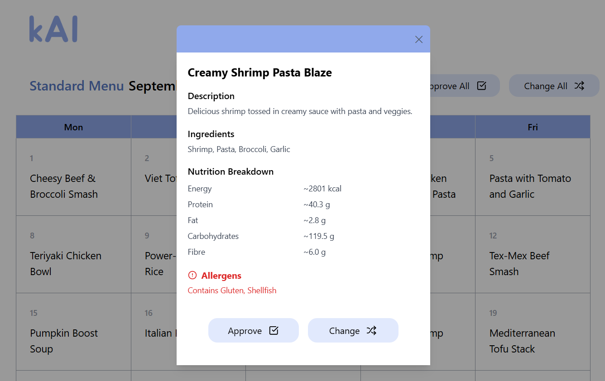

# 🥗 kAI Frontend
## Overview
This is the frontend of **kAI**, an MVP built for the **AI Hackathon 2025**.  
**kAI** is an AI-powered menu planner that helps school meal suppliers provide balanced, attractive meals within constraints such as nutrients, ingredients, and budgets, while tailoring meals to student dietary requirements. The project was designed to address **SDG 2 (Zero Hunger)** and **SDG 12 (Responsible Consumption and Production)**.

*Sample Menu Page screenshot*:  

## Features
Users (centralised meal suppliers) can:  
- View AI-generated monthly menu suggestions from the backend
- View detailed information for each meal, including ingredients, nutrition, and allergens

## Frontend Tech Stack
- React
- React Router
- Axios
- Tailwind CSS
- Lucide React (icon library)
- Vercel (deployment)

Backend Repository: [[kAI Backend](https://github.com/JauChian/kAI-backend)]

## Contributors
[AkoKBIkeda](https://github.com/AkoKBIkeda) / [JauChian](https://github.com/JauChian)

## Licence
This project is licensed under the MIT License. See [LICENSE](./LICENSE) for details.
